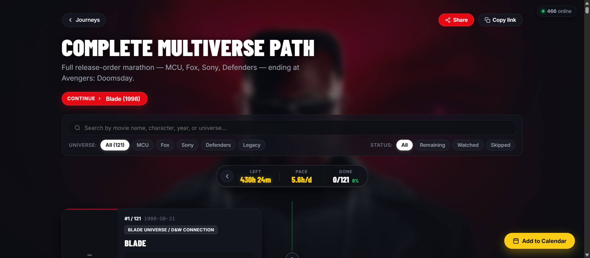
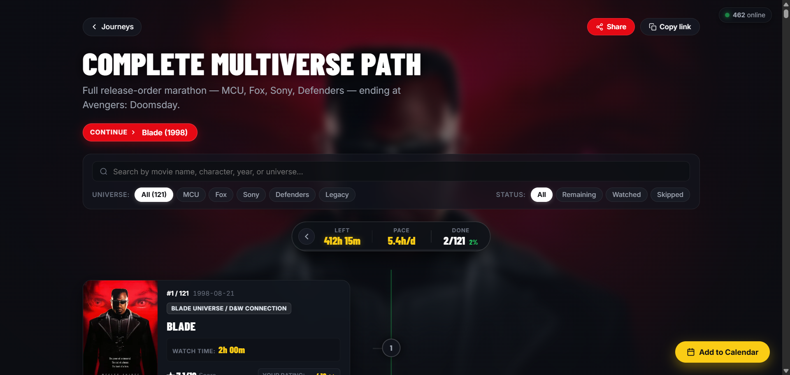
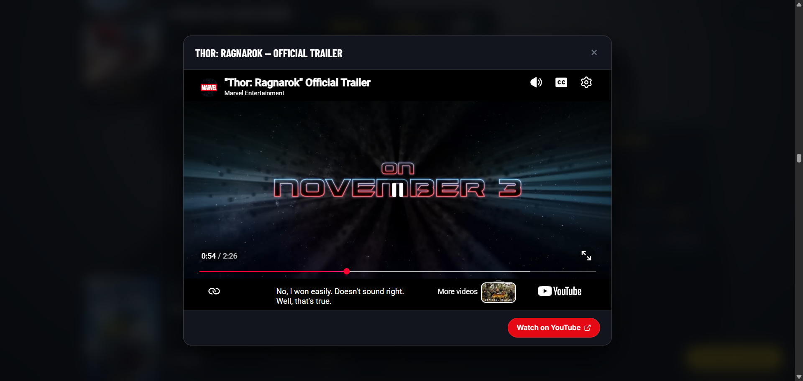
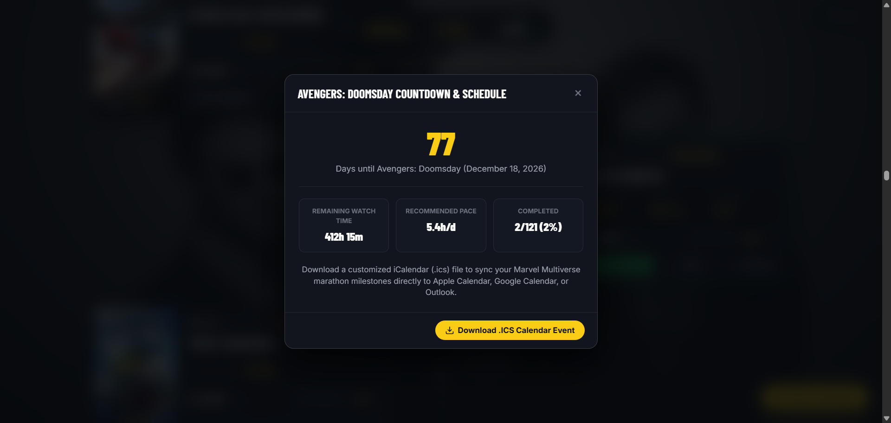

# 🎬 Marvel Multiverse Roadmap (1998 — 2026)

> **Complete release-order marathon across MCU, Fox X-Men, Sony Spider-Man, Marvel Television Defenders, and Legacy universes — culminating in *Avengers: Doomsday* (December 18, 2026).**

[](https://github.com/)
[](https://github.com/)
[](https://github.com/)
[](LICENSE)

---

## ✨ Features

- **🎯 Exact 121-Item Multiverse Path**: Complete chronological release marathon from *Blade (1998)* through *Avengers: Doomsday (December 18, 2026)*.
- **📊 Interactive Sticky HUD Rail**:
  - **LEFT**: Live watch hours & minutes remaining across unwatched titles.
  - **PACE**: Calculated hours/day needed to finish before *Avengers: Doomsday* premiere.
  - **DONE**: Live completion counter (`x/121`) with real-time percentage and progress bar.
- **🎨 Dynamic Ambient Landscape Backdrop**:
  - Full-screen high-definition backdrop automatically transitions as you scroll or hover over movie cards.
  - Dark cinematic vignette preserves high contrast and legibility.
- **🖼️ High-Quality Compressed Posters**:
  - Every title includes local high-resolution portrait posters and landscape backdrops stored in `./poster/`.
  - Served in ultra-fast, compressed WebP format with JPEG fallbacks.
- **📺 Series vs. Movie Specific Metrics**:
  - **Movies**: Displays total watch time (e.g. `2h 00m`).
  - **Series**: Displays **Total Time**, **Average Time per Episode**, and **Total Episodes** (e.g. `11h 42m | 54m/ep | 13 eps`).
- **⭐ Official & Personal Ratings**:
  - Includes critical IMDb ratings.
  - Dedicated **Your Rating** dropdown (`_ / 10`) stored locally in your browser.
- **💾 100% LocalStorage Persistence**:
  - Tracks **Mark as Watched**, **Skip**, and **Personal Ratings** directly on your device.
  - Export and import backup JSON at any time.
- **🎬 Official YouTube Trailers**:
  - Embedded responsive modal player with direct YouTube links.
- **📅 Add to Calendar (.ICS Generator)**:
  - Generates synchronized iCalendar event for the *Avengers: Doomsday* countdown and schedule milestones.
- **⚡ Real-Time Search & Universe Filtering**:
  - Instant search across title, release year, character, and universe tags.
  - Quick chips for **All (121)**, **MCU (60)**, **Fox (19)**, **Sony (15)**, **Defenders (17)**, and **Legacy (10)**.
  - Status filters: **All**, **Remaining**, **Watched**, and **Skipped**.
- **🚀 One-Click "Continue" Button**:
  - Automatically identifies the next unwatched milestone and scrolls smoothly into view.

---

## 📸 Screenshots

| Multiverse Roadmap Overview | Watched Cards & Timeline Glow |
| :---: | :---: |
|  |  |

| Official Trailer Modal | Doomsday Countdown & Schedule |
| :---: | :---: |
|  |  |

---

## 📁 Project Structure

```text
Marvel Roadmap/
├── index.html           # Semantic HTML5 frontend layout & modals
├── style.css            # Handcrafted modern Vanilla CSS with dark theme
├── app.js               # Application state, HUD calculations & interactivity
├── data.js              # JavaScript dataset of all 121 Marvel titles
├── data.json            # JSON export of the complete roadmap dataset
├── package.json         # NPM scripts and project metadata
├── .gitignore           # Git ignore rules
├── poster/              # Offline high-resolution media repository
│   ├── portrait/        # Compressed portrait posters (.webp & .jpg)
│   ├── landscape/       # Compressed landscape backdrops (.webp & .jpg)
│   └── originals/       # Full-resolution source images
├── scripts/             # Build and image optimization scripts
│   ├── build_dataset.py
│   ├── fast_download_posters.py
│   ├── generate_frontend_data.py
│   └── polish_posters.py
└── docs/                # Documentation assets & screenshots
    └── screenshots/
```

---

## 🚀 Getting Started

No database or backend server is needed. The project is completely client-side.

### Option 1: Using Node.js / NPM

```bash
# Clone the repository
git clone https://github.com/your-username/marvel-multiverse-roadmap.git
cd marvel-multiverse-roadmap

# Start the local development server
npm start
```
Then open [http://localhost:3000](http://localhost:3000) in your browser.

### Option 2: Using Python

```bash
# Python 3 built-in HTTP server
python -m http.server 3000
```
Open [http://localhost:3000](http://localhost:3000).

### Option 3: Direct File Opening
You can also directly open `index.html` in modern web browsers (Chrome, Edge, Firefox, Safari).

---

## 📽️ Multiverse Scope (121 Titles)

- **Legacy Marvel Classics (1998–2008)**: *Blade Trilogy, Daredevil, Elektra, Hulk, The Punisher, Ghost Rider*
- **Fox X-Men Universe (2000–2020)**: *X-Men 1–3, First Class, Days of Future Past, Apocalypse, Logan, Deadpool 1 & 2, Dark Phoenix, The New Mutants*
- **Sony's Spider-Man Universes (2002–2024)**: *Sam Raimi Trilogy, The Amazing Spider-Man 1 & 2, Into/Across the Spider-Verse, Venom 1–3, Morbius, Madame Web, Kraven*
- **Marvel Cinematic Universe (2008–2026)**: *Phases 1 through 6, culminating in Avengers: Doomsday*
- **Marvel Television Defenders Saga**: *Daredevil, Jessica Jones, Luke Cage, Iron Fist, The Defenders, The Punisher*
- **Marvel Animation**: *What If...? S1–S3, X-Men '97 S1–S2, Your Friendly Neighborhood Spider-Man, Eyes of Wakanda, Marvel Zombies*

---

## 🛠️ Tech Stack

- **Core**: Vanilla HTML5, Vanilla JavaScript (ES6+), Vanilla CSS
- **Design**: Modern glassmorphism, responsive alternating timeline rail, CSS Custom Properties
- **Assets**: Local compressed WebP/JPEG assets with Pillow optimization
- **APIs & Data**: Curated metadata from TMDB, IMDb, and Doomsday Roadmap

---

## 📄 License

This project is licensed under the MIT License — see the [LICENSE](LICENSE) file for details.
